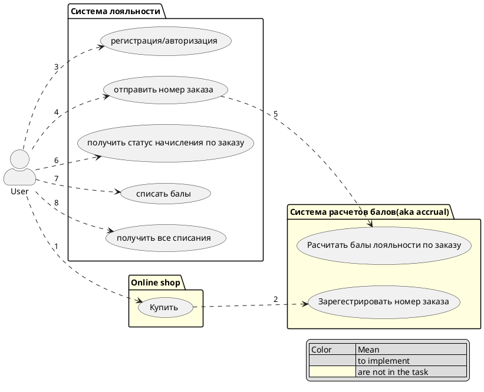
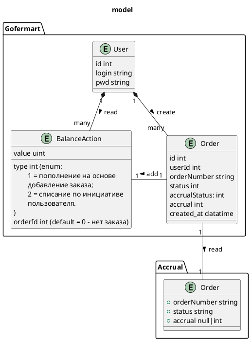
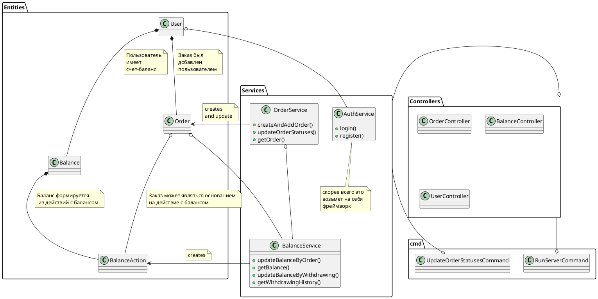

# Gofermart

## Use cases

```puml
@startuml
skinparam actorStyle awesome

legend right
| Color           | Mean                         |
|                  | to implement |
|<#lightyellow>    | are not in the task                  |
endlegend

left to right direction

actor "User" as U

package "Система лояльности" as M {
    usecase "регистрация/авторизация" as M_RA
    usecase "отправить номер заказа"as M_SON
    usecase "получить статус начисления по заказу" as M_GOS
    usecase "списать балы" as M_DB
    usecase "получить все списания" as M_DH
}

package "Система расчетов балов(aka accrual)" as ACR #lightyellow {
    usecase "Зарегестрировать номер заказа" as A_RON
    usecase "Расчитать балы лояльности по заказу" as A_CB
}
package "Online shop" as OS #lightyellow {
    usecase "Купить" as OS_B
}

U ..> M_RA : 3
U ..> M_SON : 4
M_SON ..> A_CB : 5
U ..> M_GOS : 6
U ..> M_DB : 7
U ..> OS_B : 1
OS_B ..> A_RON : 2
U ..> M_DH : 8

@enduml
```

## Model

```puml
@startuml

title model
namespace Gofermart {
    entity "User" as U {
        id int
        login string
        pwd string
    }
    entity "Order" as O1 {
        id int
        userId int
        orderNumber string
        status int
        accrualStatus: int
        accrual int
        created_at datatime
    }
    entity "BalanceAction" as BA {
        value uint
        type int (enum: \n\
        1 = пополнение на основе\n\
        добавление заказа;\n\
        2 = списание по инициативе\n\
        пользователя.\n)
        orderId int (default = 0 - нет заказа)
    }
}

namespace Accrual {
    entity "Order" as O2 {
        + orderNumber string
        + status string
        + accrual null|int
    }
}

U "1" *-d- "many" O1 : create >
U "1" *-d- "many" BA : read >
O1 "1" -l- "1" BA : add >

O1 "1"--"1" O2 : read >

@enduml
```

## Classes

```puml
@startuml

namespace "Services" as S {
    
    class "OrderService" as OS  {
        + createAndAddOrder()
        + updateOrderStatuses()
        + getOrder()
    }
    class "BalanceService" as BS {
        + updateBalanceByOrder()
        + getBalance()
        + updateBalanceByWithdrawing()
        + getWithdrawingHistory()
    }
    class "AuthService" as AS {
        + login()
        + register()
    }
    note bottom of AS 
        скорее всего это 
        возьмет на себя
        фреймворк
    end note
     S.OS o--- S.BS
}
namespace "Entities" as E {
    class "User" as U {}
    class "Order" as O {}
    class "Balance" as B {}
    class "BalanceAction" as BA {}
    E.U *-- E.B 
    note left  on link : Пользователь\nимеет\nсчет-баланс
    E.U *-- E.O 
    note left on link : Заказ был\nдобавлен\nпользователем
    E.B *-- E.BA 
    note on link: Баланс формируется\n из действий с балансом
    E.O o---  E.BA
    note on link : Заказ может являться основанием\nна действие с балансом 
}
namespace "Controllers" as C {
    class "OrderController" as OC {}
    class "BalanceController" as BC {}
    class "UserController" as UC {}
}
namespace cmd {
    class "UpdateOrderStatusesCommand" as UOSC
    class "RunServerCommand" as RSC
}
E.U o- S.AS 
E.O <- S.OS 
note on link : creates \nand update
E.O o- S.BS
E.BA <- S.BS
note on link : creates

'C.UC o- S.AS 
'C.OC o- S.OS 
'C.BC o- S.BS 
C o- S

C ---o cmd.RSC
S ---o cmd.UOSC

@enduml
```