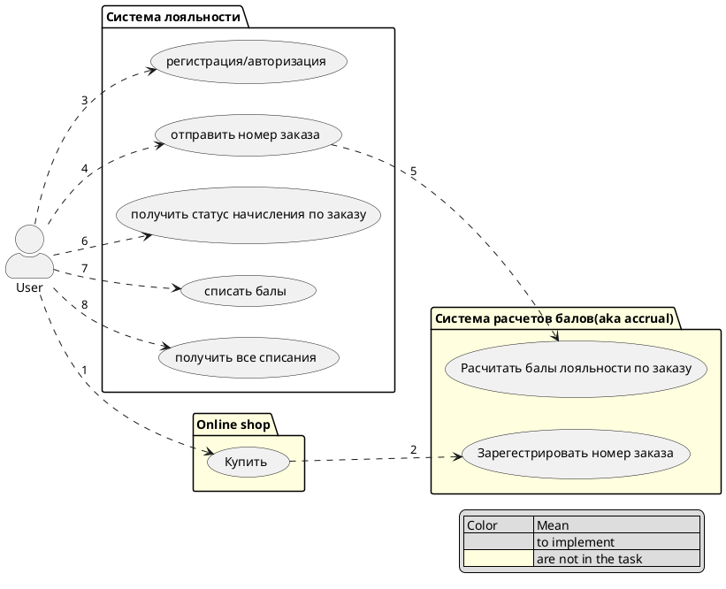
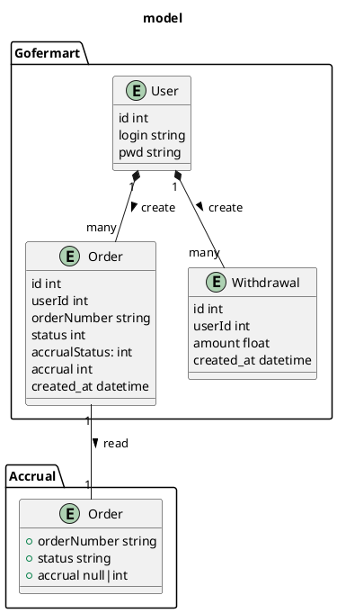
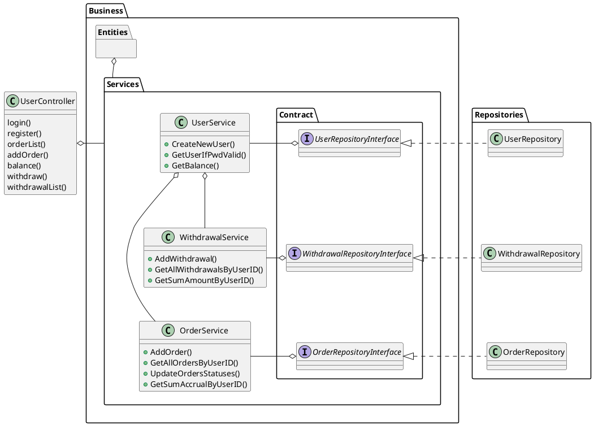

# Gofermart

## Use cases

## Model

## Classes

## Status mapping on accrual

NEW — заказ загружен в систему, но не попал в обработку;
PROCESSING — вознаграждение за заказ рассчитывается; 200(REGISTERED|PROCESSING)
INVALID — система расчёта вознаграждений отказала в расчёте; 200(INVALID), 204
PROCESSED — данные по заказу проверены и информация о расчёте успешно получена. 200(PROCESSED) 

### Accrual statuses
REGISTERED — заказ зарегистрирован, но не начисление не рассчитано;
INVALID — заказ не принят к расчёту, и вознаграждение не будет начислено;
PROCESSING — расчёт начисления в процессе;
PROCESSED — расчёт начисления окончен;